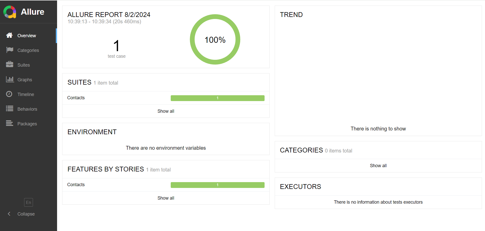

# thinking-tester-contact-list Automation

## Introduction

Welcome to the thinking-tester-contact-list automation test. This framework uses **TestNG** as test
runner **Cucumber** for code the test in BDD methodology and **Allure** as reporting tool

## Architecture

The framework was designed combining Screenplay and Page Object design patterns.

## Getting started

### Prerequisites

Before to clone the repository, ensure you have the following apps and plugins installed in your
local machine:

- **Java 21**: Make sure you have JDK 21
- **IntelliJ IDEA**: IDE suggested for development.
- **Allure setup**: For generate the test report
- **Checkstyle**: For coding check

**Plugins for IntelliJ IDEA**:

- **Checkstyle**
- **Cucumber for Java**
- **Lombok**

1. **Configuring checkstyle** :
    - Go to `File > Settings > Tools > Checkstyle`
    - Import the `google_checks.xml` file included in the repo
2. **Configuring code formatter** :
    - Go to `File > Settings > Code Style`
    - Import the `google_checks.xml` file included in the repo
3. **Install Allure**
    - Follow the instructions from
      the [Allure documentation](https://allurereport.org/docs/install/)
4. **Build and test**
    - For build and test, execute with TestNG the runner class in the repo found
      in `src/test/java/com.herokuapp/runner/RunnerTest`, by default the test run in Chrome browser
      if you want to change it, change the project.browser property
      in `test/resources/project.properties` file
5. **Generate the report**
    - After the execution, the project creates the `allure-results` folder. In a command line with
      the
      repo location, run the command `allure serve allure-results` and automatically a browser will
      open with the allure report.

6. **Test feature**
    - The test is located in `src/test/resources/features` in Gherkin language